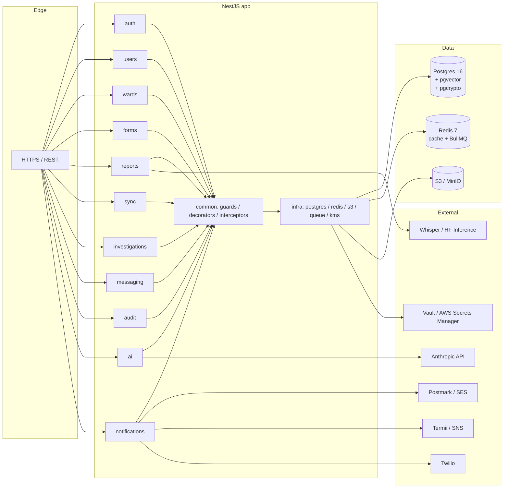
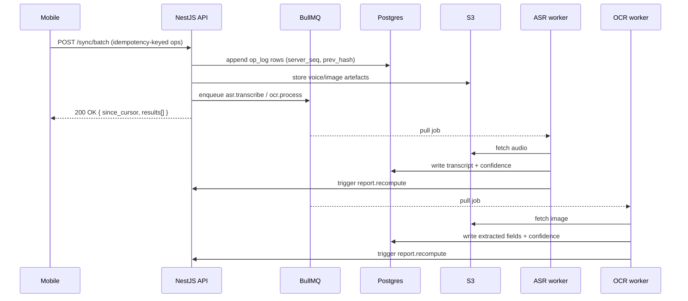
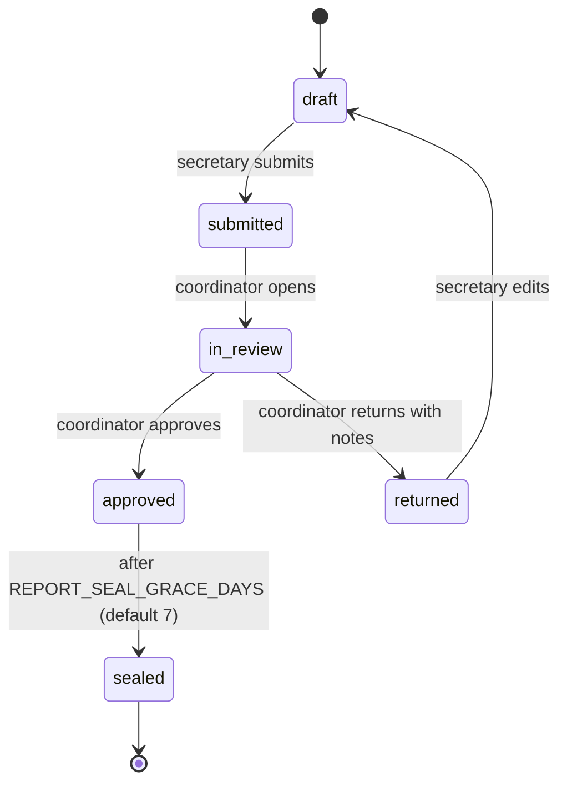

# Architecture — WDC Backend

Living document. Every architectural choice is logged here in summary; the authoritative ADRs live in `.handoff/DECISIONS.md`. When this document and an ADR disagree, the ADR wins.

## 1. Stack

| Layer            | Choice                                              | ADR    | Why (one-line)                                                  |
| ---------------- | --------------------------------------------------- | ------ | --------------------------------------------------------------- |
| Runtime          | Node 20 LTS                                         | 001    | Prompt-mandated; broad NestJS 10 support                        |
| Framework        | NestJS 10 (TypeScript)                              | 002    | Modular DI matches the bounded-context list cleanly             |
| ORM              | Drizzle ORM                                         | 002    | Type-safe queries, robust migration story (TypeORM rejected)    |
| DB               | Postgres 16 + `pgvector` + `pgcrypto` + `pg_trgm`   | 002    | One system of record; vector search co-located                  |
| Cache & queues   | Redis 7 + BullMQ                                    | 002    | Standard, ops-simple                                            |
| Object storage   | MinIO (dev) / S3-compatible (prod)                  | 002    | OCR/voice/PDF artefacts                                         |
| Logging          | pino → stdout JSON (`nestjs-pino`)                  | 002    | Structured by default; easy to ship                             |
| Tracing          | OpenTelemetry → OTLP                                | 002    | Vendor-neutral                                                  |
| Metrics          | Prometheus `/metrics`                               | 002    | Standard pull-model                                             |
| Containers       | Multi-stage build → distroless `nodejs20`, non-root | 002    | Minimal attack surface                                          |
| Repo layout      | `DigiWDC/` is the repo root                         | 004    | Simpler paths; matches `.handoff/` conventions                  |

## 2. Module map

## 3. Data-flow — submitting a report

## 4. Authorization model — RLS at the database

The application supplies four GUCs at the start of every request via `SET LOCAL`:

| GUC                  | Source                              |
| -------------------- | ----------------------------------- |
| `app.current_user_id` | JWT `sub` claim                     |
| `app.current_role`    | JWT `role` claim                    |
| `app.current_lga_id`  | Lookup from `users` row (cached)    |
| `app.current_ward_id` | Lookup from `users` row (cached)    |

RLS policies (introduced in M2) enforce role scope at the database, not the application:

- `secretary` — read+write only their own ward's reports/messages.
- `coordinator` — read all wards in their LGA, write approval/return decisions only.
- `director` — full state read; write forms/users/investigations/broadcasts/settings; cannot retroactively edit a sealed report's content.
- `system` — used by background jobs (BullMQ workers); logged distinctly in audit.

Application-level RBAC (`@Roles()`) is a defence-in-depth layer; the database is the source of truth.

## 5. State machine — Report lifecycle

History is append-only (CRDT-style log of operations). Once `sealed`, content is immutable; only review-state metadata can change.

## 6. Sync semantics

- Mobile clients submit via `POST /sync/batch` with an `Idempotency-Key` header per batch and an `op_id` (UUIDv7) per operation.
- Server-side de-duplication: the same `(op_id, idempotency_key)` returns the original result, never a duplicate side-effect.
- **LWW is banned for report content.** Operations are append-only; canonical state is derived. Coordinator review actions (approve/return) are similarly append-only — decisions are never lost.
- Server stamps `server_seq` on accept; clients pull updates via `since_cursor`.
- Property test (M6) proves: same operations applied in any order yield the same canonical state.

## 7. AI Assistant orchestration (M12)

All director-facing AI queries hit `POST /ai/ask`. Server-side only.

Two retrieval layers feed Claude:

1. **Structured retrieval** — typed SQL templates against the `wdc_ro` read-only role. Results JSON-encoded into the prompt.
2. **Semantic retrieval** — `pgvector` cosine top-K over embedded free-text fields (investigation notes, decisions).

The system prompt forbids fabrication and requires citations of the form `[source: structured#<query_id>]` / `[source: semantic#<embedding_id>]`. Server validates citations before returning the response. Cache key: `sha256(question_normalized || retrieval_results_canonical || role_scope)`, TTL 1h.

## 8. Performance & resilience targets

- p95 read < 200ms @ 100 RPS, p95 write < 500ms (excluding async OCR/ASR).
- `POST /sync/batch` accepts and acks 50 ops in < 1s.
- Sliding-window rate limiting per `(role, device_id, route_template)` in Redis.
- Circuit breakers around every external dependency (Anthropic, Twilio, SES, Termii). Failures degrade gracefully (e.g. AI returns "data available, narrative unavailable" rather than 500).
- `/health/live` (process up) and `/health/ready` (deps up) for k8s probes.
- Backups: daily PG base backup + WAL archiving, 30-day retention. Restore drill in `RUNBOOK.md` (M13).

## 9. Security posture

See `THREATS.md` for the full threat model. Highlights:

- TLS 1.3 only at the edge.
- Column-level encryption (`pgcrypto`) for names, phone plaintext, voice transcript text. App key wrapped by KMS; key id stored alongside ciphertext for rotation.
- Phone numbers stored twice — `phone_hash` (sha256 of E.164, indexed) and `phone_ciphertext` (encrypted, display-only).
- `@Sensitive()` decorator + redaction middleware strip PII from logs.
- NDPR right-to-erasure as soft-erasure: hash identifiers in historical rows, preserve aggregates. Procedure documented in `RUNBOOK.md`.

## 10. Assumptions to confirm

These are reasonable defaults until the State team confirms or overrides. **Each is gated on user input before M14.**

| # | Assumption                                                                                            | Where to revisit            |
| - | ----------------------------------------------------------------------------------------------------- | --------------------------- |
| 1 | The 23 LGAs and 255 ward names will be supplied as a CSV; M2 seed script uses realistic Kaduna stubs. | M2 seed                     |
| 2 | Production hosts on a Kubernetes cluster (Galaxy Backbone-eligible image registry).                   | M13 ops                     |
| 3 | Postgres in production is a managed service (DigitalOcean / AWS RDS / equivalent) with WAL archiving. | M13 backups                 |
| 4 | SMS provider is Termii (Nigerian numbers); fallback AWS SNS.                                          | M10 messaging               |
| 5 | WhatsApp via Twilio Business API; activation pending a Meta verified business account.                | M10 messaging               |
| 6 | Hausa ASR is self-hosted Whisper-large-v3 in dev; production may switch to HF Inference Endpoints.    | M8 voice pipeline           |
| 7 | Embedding model is `text-embedding-3-small` (cheap, sufficient for top-K filter).                     | M12 AI assistant            |
| 8 | KMS in production is HashiCorp Vault Transit; AWS KMS acceptable as alternate.                        | M3 auth + M14 hardening     |
| 9 | Quiet hours are 22:00–06:00 WAT, system-wide constant (configurable later).                           | M10 messaging               |
| 10 | Sealing grace period is 7 days (configurable via `REPORT_SEAL_GRACE_DAYS`).                          | M6 reports                  |

## 11. Decisions log

See `.handoff/DECISIONS.md`. Currently:
- ADR-001: Node 20 in CI/Docker; Node 22+ tolerated in dev.
- ADR-002: Stack confirmation (NestJS 10 + Drizzle + Postgres 16 + Redis 7 + MinIO + pgvector).
- ADR-003: `.handoff/` continuity layer in repo root.
- ADR-004: `DigiWDC/` is the repo root; spec docs at `docs/spec/`.
- ADR-005: Local dev ports avoid 5432/6379/9000 conflicts.
