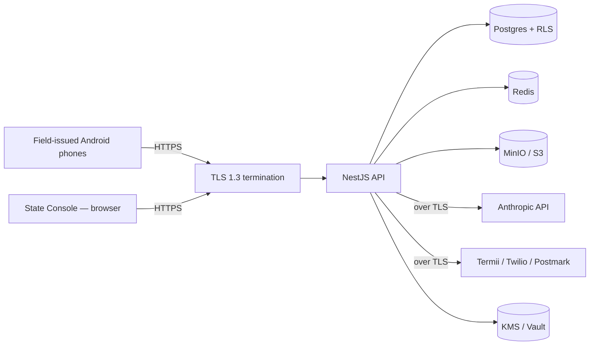

# Threat model — WDC Backend

NDPR + ISO 27001-aligned. Reviewed each milestone; mitigations added as they're implemented.

## Trust boundaries

Every arrow that crosses a boundary is a candidate for the threat catalogue.

## Threats and mitigations

| #  | Threat                                                                                | Mitigation                                                                                                      | Status   |
| -- | ------------------------------------------------------------------------------------- | --------------------------------------------------------------------------------------------------------------- | -------- |
| 1  | Stolen device → token theft → impersonate secretary                                   | Refresh tokens are device-bound (signed device fingerprint); compromised device → revoke device, all sessions die | M3       |
| 2  | Coordinator with valid creds exfiltrates state-wide data                              | RLS at DB scopes coordinator to their LGA; audit log records every read of out-of-scope endpoints (denied)       | M2 + M3  |
| 3  | Malicious coordinator edits a returned report's review notes after the fact           | Append-only history: edits append a new event; the original is preserved and surfaced in the audit trail        | M6 + M11 |
| 4  | Replay attack on `POST /sync/batch`                                                   | Idempotency keys deduplicated server-side for 24h; same key → original result, never a duplicate write          | M7       |
| 5  | Prompt injection via voice transcript ("ignore previous instructions and...")          | Voice transcripts go into the prompt as user-supplied data with explicit `<<UNTRUSTED>>` framing; system prompt is fixed and forbids cross-instruction following | M12      |
| 21 | Vulnerable dependencies (23 CVEs found in transitive deps)                            | Dependency audit performed M14; schedule updates for: glob, multer, lodash, drizzle-orm, picomatch, esbuild    | M14      |
| 6  | OCR-driven content injection (a forged image with text that triggers tool calls)      | Same UNTRUSTED framing; tool use is server-orchestrated, not model-orchestrated; AI assistant has no tool access | M12      |
| 7  | Audit log tampering by a DBA with direct Postgres access                              | Hash-chained appends (`hash = sha256(prev_hash || canonical_json(event))`); daily anchor digest signed and archived externally; tampering breaks the chain | M11      |
| 8  | Credential stuffing on directors                                                      | TOTP 2FA mandatory for `director`; failed attempts rate-limited and audited                                     | M3       |
| 9  | Brute-force PIN guessing on the secretary mobile flow                                 | Argon2id with `m=64MB,t=3,p=1` + per-deployment pepper from KMS; mobile-side rate limit + server-side lockout    | M3       |
| 10 | PII leakage via logs                                                                  | `@Sensitive()` decorator + redaction middleware; pino redact paths for known fields; CI lint rule against `console.log` of typed PII fields | M1 (decorator) + M3 (middleware) |
| 11 | Phone number enumeration via login error messages                                     | Same response shape and timing for "user not found" vs "wrong PIN"; rate-limited                                | M3       |
| 12 | Insecure direct object reference on `/reports/:id`                                    | RLS denies cross-scope access at the DB; tests assert RLS denial path returns 404 (not 403, to avoid leakage)   | M2 + M6  |
| 13 | Stolen S3 access keys exfiltrate voice notes                                          | Per-environment IAM, dev/prod isolated; signed URLs with TTL ≤ 5 min; bucket policy denies public ACLs          | M8       |
| 14 | Out-of-scope SQL via the AI Assistant's structured-retrieval path                     | Typed SQL templates only — no string-concatenated dynamic SQL; executed under `wdc_ro` role with read-only grants | M12      |
| 15 | Server-side request forgery via image fetch in OCR pipeline                           | OCR fetches only from our own MinIO/S3 via signed URLs; no user-supplied URLs accepted by the worker             | M8       |
| 16 | Unauthorised right-to-erasure abuse (an attacker erases a victim's records)           | Right-to-erasure endpoint requires director auth + TOTP step-up + 2-of-3 director approval; full audit         | M14      |
| 17 | Crypto key compromise                                                                 | KMS-wrapped DEKs with `key_id` stored alongside ciphertext; rotation procedure in `RUNBOOK.md`; column-level    | M3 + M13 |
| 18 | Quiet-hours bypass for marketing-style broadcasts                                     | Server enforces 22:00–06:00 WAT delay for non-urgent classifications; only `urgent` classification can bypass, and bypassing is itself audited | M10 |
| 19 | Drizzle migration regression silently dropping a column                               | Migrations numbered, immutable post-merge, applied via `drizzle-kit migrate` with explicit `--ack`; CI runs migrations against a fresh DB on every PR | M2 |
| 20 | Supply-chain attack via a compromised dependency                                      | `pnpm audit --audit-level=high` blocks merge; Trivy scans the runtime image for HIGH/CRITICAL; lockfile-only installs in CI | M1 (CI) + M14 |

## Out of scope (for now)

- DDoS at the network edge — handled by the production CDN / WAF (configuration documented in `RUNBOOK.md` once deployment target is confirmed).
- Physical device security — outside our trust boundary; mitigated only insofar as device-bound tokens limit the blast radius.

## Review cadence

Reviewed at the end of every milestone. Each new component must add its own entries before its milestone tag.
